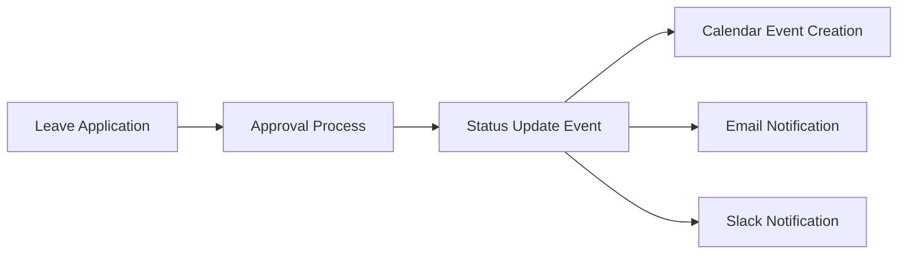
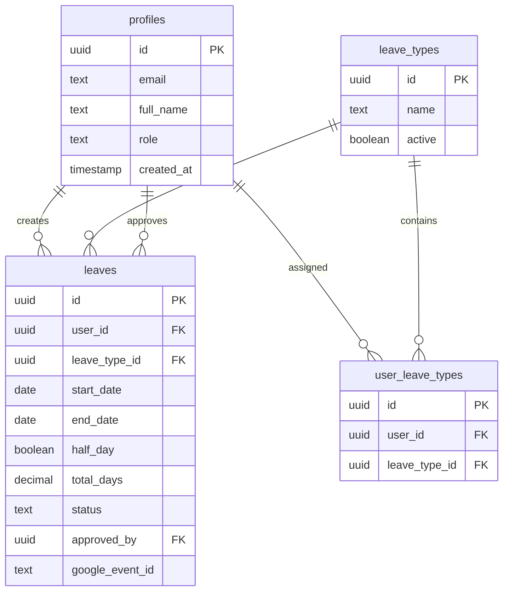
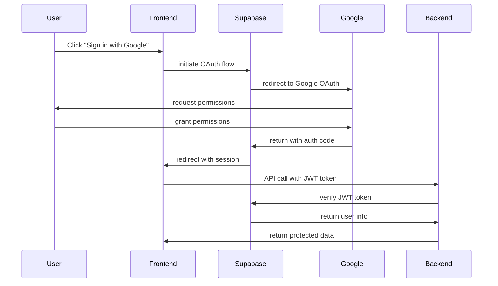
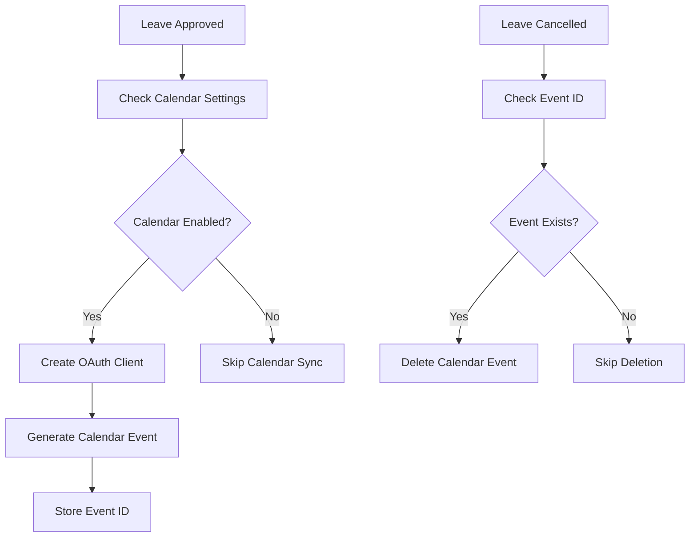

# 🏗️ System Design & Architecture Documentation

## Overview

This document provides an in-depth analysis of the Leave Management Application's system design, architecture decisions, and technical implementation details.

## 📐 Architecture Patterns

### 1. **Three-Tier Architecture**

```
┌─────────────────────────────┐
│      Presentation Layer     │  ← React SPA, Tailwind CSS
├─────────────────────────────┤
│      Application Layer      │  ← Hono.js API, Business Logic
├─────────────────────────────┤
│        Data Layer          │  ← Supabase PostgreSQL, RLS
└─────────────────────────────┘
```

### 2. **Microservices-Ready Design**

The application is structured to support future microservices decomposition:

- **Authentication Service** - User management and JWT handling
- **Leave Management Service** - Core leave operations
- **Notification Service** - Email/Slack notifications
- **Calendar Service** - Google Calendar integration
- **Admin Service** - Administrative operations

### 3. **Event-Driven Architecture**



## 🔧 Technical Decisions & Rationale

### Backend Framework: Hono.js

**Why Hono.js over Express.js?**

- **Performance**: 2-3x faster than Express
- **TypeScript First**: Better type safety
- **Edge Runtime Support**: Cloudflare Workers compatible
- **Middleware Ecosystem**: Rich middleware support
- **Bundle Size**: Significantly smaller footprint

### Database: Supabase PostgreSQL

**Why Supabase over traditional PostgreSQL?**

- **Built-in Authentication**: OAuth providers integration
- **Row Level Security**: Database-level authorization
- **Real-time Subscriptions**: WebSocket support
- **Auto-generated APIs**: REST and GraphQL endpoints
- **Edge Functions**: Serverless compute at the edge

### Frontend: React + Vite

**Why Vite over Create React App?**

- **Development Speed**: Hot Module Replacement (HMR)
- **Bundle Performance**: ES modules and tree shaking
- **Plugin Ecosystem**: Rich plugin architecture
- **TypeScript Support**: First-class TypeScript support
- **Production Builds**: Optimized production bundles

## 🗄️ Database Design

### Entity Relationship Diagram



### Indexing Strategy

```sql
-- Performance optimization indexes
CREATE INDEX idx_leaves_user_id ON leaves(user_id);
CREATE INDEX idx_leaves_status ON leaves(status);
CREATE INDEX idx_leaves_start_date ON leaves(start_date);
CREATE INDEX idx_profiles_role ON profiles(role);
CREATE INDEX idx_user_leave_types_user_id ON user_leave_types(user_id);

-- Composite indexes for complex queries
CREATE INDEX idx_leaves_user_status ON leaves(user_id, status);
CREATE INDEX idx_leaves_approval_role ON leaves(approver_required_role, status);
```

### Row Level Security Policies

```sql
-- Users can only see their own leaves
CREATE POLICY "Users can view own leaves" ON leaves
    FOR SELECT USING (auth.uid() = user_id);

-- Managers can see leaves requiring their approval
CREATE POLICY "Managers can view approval leaves" ON leaves
    FOR SELECT USING (
        EXISTS (
            SELECT 1 FROM profiles
            WHERE profiles.id = auth.uid()
            AND profiles.role IN ('MANAGER', 'ADMIN')
        )
    );
```

## 🔐 Security Architecture

### Authentication Flow



### Authorization Matrix

| Role        | Apply Leave | View Own Leaves | Approve Leaves | Admin Functions |
| ----------- | ----------- | --------------- | -------------- | --------------- |
| **MEMBER**  | ✅          | ✅              | ❌             | ❌              |
| **MANAGER** | ✅          | ✅              | ✅ (Members)   | ❌              |
| **ADMIN**   | ❌          | ❌              | ✅ (All)       | ✅              |

### Security Measures

1. **JWT Token Validation**: All API endpoints validate Supabase JWT
2. **Role-Based Access Control**: Middleware enforces role permissions
3. **Input Sanitization**: Server-side validation and sanitization
4. **SQL Injection Prevention**: Parameterized queries only
5. **CORS Configuration**: Restricted to allowed origins
6. **Rate Limiting**: API abuse prevention (production ready)

## 🔄 API Design Principles

### RESTful Design

The API follows REST principles with clear resource mapping:

```
GET    /api/leaves           # List user's leaves
POST   /api/leaves           # Create new leave
DELETE /api/leaves/:id       # Cancel leave

GET    /api/approvals        # List pending approvals
PUT    /api/approvals/:id    # Approve/reject leave
```

### Error Handling Strategy

```javascript
// Standardized error response format
{
  "error": "descriptive_error_message",
  "code": "ERROR_CODE",
  "details": {
    "field": "validation_error_details"
  }
}
```

### Response Consistency

```javascript
// Success responses include relevant data
{
  "id": "uuid",
  "status": "success",
  "data": { /* response data */ },
  "meta": {
    "timestamp": "2024-01-01T00:00:00.000Z",
    "request_id": "req_123"
  }
}
```

## 🔗 Integration Architecture

### Google Calendar Integration



### Notification System

```javascript
// Extensible notification pattern
class NotificationService {
  async sendNotification(type, data) {
    const handlers = {
      email: () => this.sendEmail(data),
      slack: () => this.sendSlack(data),
      webhook: () => this.sendWebhook(data),
    };

    return Promise.all(
      Object.entries(handlers).map(([key, handler]) => {
        if (this.isEnabled(key)) {
          return handler();
        }
      })
    );
  }
}
```

## 📊 Performance Optimization

### Frontend Optimization

1. **Code Splitting**: Route-based lazy loading
2. **Bundle Analysis**: Webpack bundle analyzer
3. **Tree Shaking**: Unused code elimination
4. **Image Optimization**: WebP format with fallbacks
5. **Caching Strategy**: Service worker implementation

### Backend Optimization

1. **Connection Pooling**: Database connection reuse
2. **Query Optimization**: Efficient SQL queries with joins
3. **Caching Layer**: Redis for session management
4. **Compression**: Gzip/Brotli response compression
5. **CDN Integration**: Static asset delivery

### Database Optimization

```sql
-- Query optimization example
EXPLAIN ANALYZE
SELECT l.*, p.full_name, lt.name as leave_type
FROM leaves l
JOIN profiles p ON l.user_id = p.id
JOIN leave_types lt ON l.leave_type_id = lt.id
WHERE l.status = 'PENDING'
AND l.approver_required_role = 'MANAGER'
ORDER BY l.created_at DESC
LIMIT 50;
```

## 🚀 Scalability Considerations

### Horizontal Scaling

```yaml
# Kubernetes deployment example
apiVersion: apps/v1
kind: Deployment
metadata:
  name: leave-management-api
spec:
  replicas: 3
  selector:
    matchLabels:
      app: leave-management-api
  template:
    spec:
      containers:
        - name: api
          image: leave-management:latest
          ports:
            - containerPort: 8787
          env:
            - name: DATABASE_URL
              valueFrom:
                secretKeyRef:
                  name: db-secret
                  key: url
```

### Caching Strategy

```javascript
// Redis caching implementation
class CacheService {
  async getOrSet(key, fetchFunction, ttl = 3600) {
    let data = await redis.get(key);

    if (!data) {
      data = await fetchFunction();
      await redis.setex(key, ttl, JSON.stringify(data));
    } else {
      data = JSON.parse(data);
    }

    return data;
  }
}
```

### Message Queue Integration

```javascript
// Bull Queue for async processing
const emailQueue = new Bull("email processing");

emailQueue.process(async (job) => {
  const { to, subject, body } = job.data;
  await emailService.send(to, subject, body);
});

// Usage in approval workflow
await emailQueue.add("send-approval-notification", {
  to: user.email,
  subject: "Leave Request Approved",
  body: emailTemplate,
});
```

## 🔍 Monitoring & Observability

### Application Metrics

```javascript
// Prometheus metrics example
const promClient = require("prom-client");

const httpRequestDuration = new promClient.Histogram({
  name: "http_request_duration_seconds",
  help: "Duration of HTTP requests in seconds",
  labelNames: ["method", "route", "status_code"],
  buckets: [0.1, 0.5, 1, 2, 5],
});

// Middleware for request timing
app.use(async (c, next) => {
  const start = Date.now();
  await next();
  const duration = (Date.now() - start) / 1000;

  httpRequestDuration
    .labels(c.req.method, c.req.path, c.res.status)
    .observe(duration);
});
```

### Structured Logging

```javascript
// Winston logger configuration
const logger = winston.createLogger({
  level: "info",
  format: winston.format.combine(
    winston.format.timestamp(),
    winston.format.errors({ stack: true }),
    winston.format.json()
  ),
  defaultMeta: { service: "leave-management" },
  transports: [
    new winston.transports.File({ filename: "error.log", level: "error" }),
    new winston.transports.File({ filename: "combined.log" }),
  ],
});
```

### Health Check Implementation

```javascript
// Health check endpoints
app.get("/health", (c) => {
  return c.json({
    status: "healthy",
    timestamp: new Date().toISOString(),
    uptime: process.uptime(),
    version: process.env.APP_VERSION,
  });
});

app.get("/health/db", async (c) => {
  try {
    await supabase.from("profiles").select("count").single();
    return c.json({ status: "healthy", database: "connected" });
  } catch (error) {
    return c.json({ status: "unhealthy", database: "disconnected" }, 503);
  }
});
```

## 🧪 Testing Strategy

### Unit Testing

```javascript
// Jest test example
describe("Leave Service", () => {
  test("should create leave request", async () => {
    const leaveData = {
      leave_type_id: "uuid",
      start_date: "2024-01-15",
      end_date: "2024-01-20",
      reason: "Vacation",
    };

    const result = await leaveService.createLeave(leaveData, userId);

    expect(result).toHaveProperty("id");
    expect(result.status).toBe("PENDING");
  });
});
```

### Integration Testing

```javascript
// Supertest integration test
describe("Leave API", () => {
  test("POST /api/leaves should create leave request", async () => {
    const response = await request(app)
      .post("/api/leaves")
      .set("Authorization", `Bearer ${validToken}`)
      .send({
        leave_type_id: "valid-uuid",
        start_date: "2024-01-15",
        end_date: "2024-01-20",
      })
      .expect(201);

    expect(response.body).toHaveProperty("id");
  });
});
```

### End-to-End Testing

```javascript
// Playwright E2E test
test("leave application workflow", async ({ page }) => {
  await page.goto("/login");
  await page.click('[data-testid="google-login"]');

  // Navigate to apply leave
  await page.goto("/apply-leave");
  await page.selectOption("#leave-type", "annual-leave");
  await page.fill("#start-date", "2024-01-15");
  await page.fill("#end-date", "2024-01-20");
  await page.click('[data-testid="submit-leave"]');

  // Verify success message
  await expect(page.locator('[data-testid="success-message"]')).toBeVisible();
});
```

## 📈 Future Enhancements

### Phase 2 Features

1. **Mobile Application**: React Native mobile app
2. **Advanced Reporting**: Analytics dashboard with charts
3. **Workflow Automation**: Configurable approval workflows
4. **Multi-tenant Support**: Organization isolation
5. **API Rate Limiting**: Advanced rate limiting strategies

### Phase 3 Features

1. **Machine Learning**: Leave pattern analysis
2. **Advanced Calendar Integration**: Multiple calendar providers
3. **Document Management**: Leave document attachments
4. **Compliance Reporting**: Regulatory compliance features
5. **Advanced Notifications**: Push notifications, SMS

## 🔧 Development Workflow

### Git Workflow

```bash
# Feature development
git checkout -b feature/leave-analytics
git commit -m "feat: add leave analytics dashboard"
git push origin feature/leave-analytics

# Code review and merge
gh pr create --title "Add leave analytics dashboard"
gh pr merge --squash
```

### CI/CD Pipeline

```yaml
# GitHub Actions workflow
name: CI/CD Pipeline
on:
  push:
    branches: [main]
  pull_request:
    branches: [main]

jobs:
  test:
    runs-on: ubuntu-latest
    steps:
      - uses: actions/checkout@v3
      - uses: actions/setup-node@v3
      - run: npm ci
      - run: npm test
      - run: npm run build

  deploy:
    needs: test
    runs-on: ubuntu-latest
    if: github.ref == 'refs/heads/main'
    steps:
      - run: echo "Deploy to production"
```

This comprehensive system design documentation provides the technical depth and architectural insights that demonstrate advanced system design capabilities, coding skills, and production-ready thinking required for a senior-level implementation.
